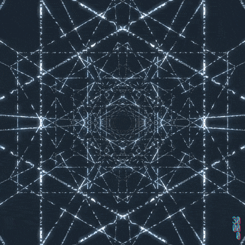

<h2 align="center"> Vue.js </h2>
<!-- https://shields.io/ -->

  
  </a>
    
  </a>
  
  
    
  </a>
  </a>
    
  </a>
  </a>
    
  </a>
  </a>
    
  
  

<table align="center">
  <tr>
    <td align="center" style="padding=0;width=50%;">
      
    </td>
  </tr>
</table>

## Table of Contents

| Numeration   | Check       | Stiker        |    Topic      |   Quantization   |    Edit Gitpot    |    Downloads    |  link  |
| ------------ |-------------|-------------- |----------------- |------------------ |---------------- |-------------- |------------- |
|  001   |:heavy_check_mark: | | [Instacion](#Instacion)   | 🐫    | 💻 | 💾 | [ ⬅️ back](https://github.com/BrianMarquez3)| 

Vue.js (comúnmente conocido como Vue; se pronuncia /vjuː/, como "view"3​) es un framework de JavaScript de código abierto para la construcción de interfaces de usuario y aplicaciones de una sola página. Fue creado por Evan You, y es mantenido por él y por el resto de los miembros activos del equipo central que provienen de diversas empresas como Netlify y Netguru.4

## Instacion

📦 [Install Perl 5](https://www.perl.org/get.html) get the installer for windows 
📦 [Install strawberry Perl](https://strawberryperl.com/) get the installer for windows Strawberry Perl 

| File                       | Numeration  | Link        |    Folk     |  Code       | Version     | State       | Download    |  Go back    |
|----------------------------|:-----------:|:-----------:|:-----------:|:-----------:|:-----------:|:-----------:|:-----------:|:-----------:|
| [Hola Perl](https://github.com/BrianMarquez3/Perl-Course/tree/main/001%20PrimerScript)  | 001 | ✔️  | ✔️ | yes | yes | ✔️ | 💾 | [⬅️Atras](#Table-of-Contents)

 <table align="center">
    <tr>
      <td colspan="3">A</td>
        <td>B</td>
      </tr>
      <tr>
        <td>C</td>
      <td colspan="2"></td>
        <td>E</td>
      </tr>
      <tr>
      <td colspan="3">F</td>
        <td>G</td>
    </tr>
</table>
